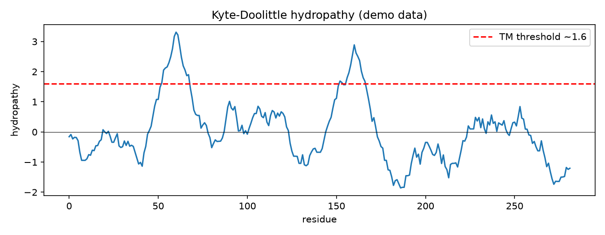

# Protein Hydropathy Plot

Before any crystal structure or AlphaFold model, a protein's sequence already whispers where it sits in the cell. Hydrophobic stretches mean membrane; the hydropathy plot reads them out.

## Why This Matters

Transmembrane helices are ~20 hydrophobic residues in a row, and buried cores are hydrophobic too. The Kyte-Doolittle scale assigns each amino acid a water-liking score; a windowed average reveals stretches hydrophobic enough to cross a membrane — the first, cheapest topology prediction you can make.

## How It Works

1. Map each residue to its Kyte-Doolittle hydropathy value.
2. Average over a ~19-residue sliding window.
3. Peaks above ~1.6 flag likely transmembrane segments.

## What the Demo Shows



The demo plants two hydrophobic stretches in a random protein. The profile crosses the transmembrane threshold twice — exactly the peaks you would call as candidate membrane-spanning helices.

## Run It

```bash
pip install -r requirements.txt
python demo.py
```

> Demonstrated on synthetic data, so it's fully reproducible with no external downloads.
